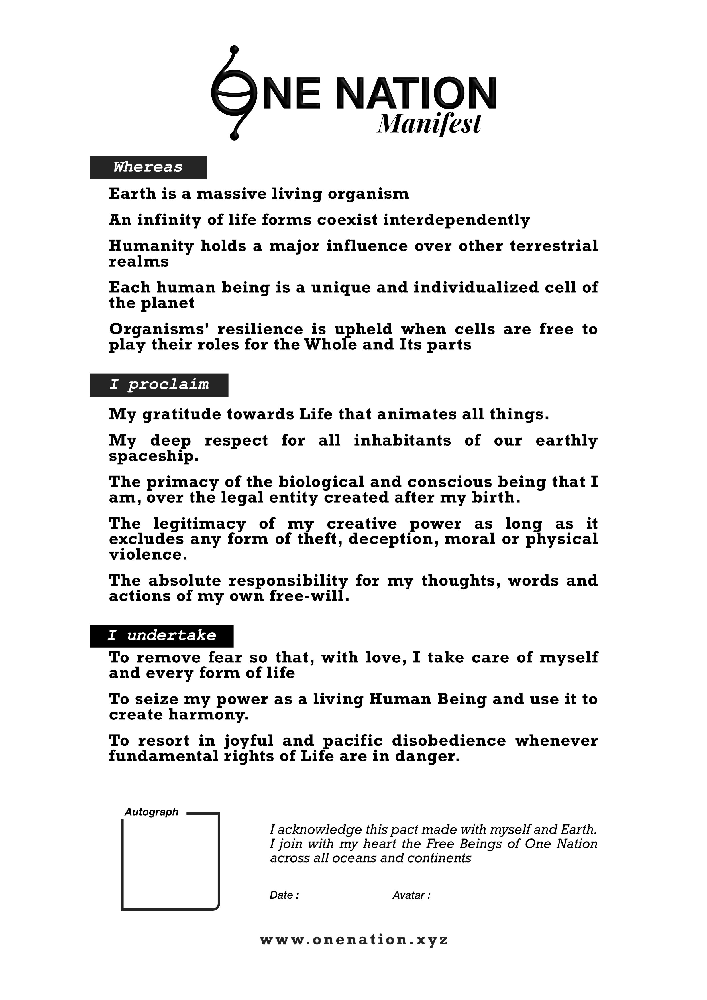

[Read the Manifest](./manifest) // [Download the Manifest](./medias/print/manifest_A4)

## Website

Visit the website on : [https://onenation.xyz](https://onenation.xyz)

## The vision

### Heart of One Nation

Governments fail to take care of Humans and Earth.  
We don’t trust them.  
We don’t respect them.


But… what can we do?

Complains are boring.  
Protests are painful.  
Elections ? Fruitless.

**So... Why don't we start a nation?**
    
### Spirit of One Nation

One Nation is a **planetary wave** peacefully emancipating human beings from non-legitimate authorities.

Here, anger and fear give way to **creativity** and **courage**.

No need for new chiefs, nor for news laws and institutions.  
The Manifest warrants our **common quest for harmony**.
    
This text is the hyphen between all our differences.  
So that mutual trust makes us **act spontaneously in stigmergy**.
    
### Body of One Nation

First, One Nation vibrates in **each one of us**, every time a human being sign the Manifest with the heart and the soul.
    
Together, we form a **decentralised network** of human beings and oasis embracing the values of the Manifest
    
Every oasis, fixed or movable, is free to experiment its own organisation.
    
One Nation connects **open-source projects** that **build up alternatives to usual instruments of power** such as : identity, money, education, food, medias, ...

## DISCLAIMER

**By nation we mean :** "Vast group of human beings, conscious about their unity and claiming the desire to live together" [Read more](https://onenation.xyz/en/faq-why-one-nation)

**One Nation is profoundly non-violent.** [Read more](https://onenation.xyz/en/#faq-non-violence)

**One Nation is not, and will never be** a country, a state, a political party, an institution, association,NGO, lobby, company, a cult or a New World Order. [Read more](https://onenation.xyz/en/#faq-what-is-one-nation)

**One Nation doesn't have any official media or spokepersons**: No individual or group may claim speaking in the name of multitude. [Read more about wouino](https://onenation.xyz/en/#faq-project-wouino)

**One Nation is not able to exclude anyone.** For that it would require a judge, a justice organ, laws, institutions, and so on 🤯😓 [Read more](https://onenation.xyz/en/#faq-constitution)

## Roadmap

Browse [the roadmap](ROADMAP.md)

## FAQ

Visit [onenation.xyz/en/#faq](https://onenation.xyz/en/#faq)

## Downloads

See [medias folder](medias)

## Contribute

One Nation is headless so you are free to collaborate/append/modifiy/fork anything without asking permission.

As long as your intentions embrace the values of the Manifest, go for it! 

If you want to meet people, you can join the party on Telegram : 
- Open Telegram 
- Search for **onenation_en** (or onenation_fr, ...)
- Browse between all public groups
- Join the party 🥳

Read more about [Telegram groups](https://onenation.xyz/en/#faq-contribute)
