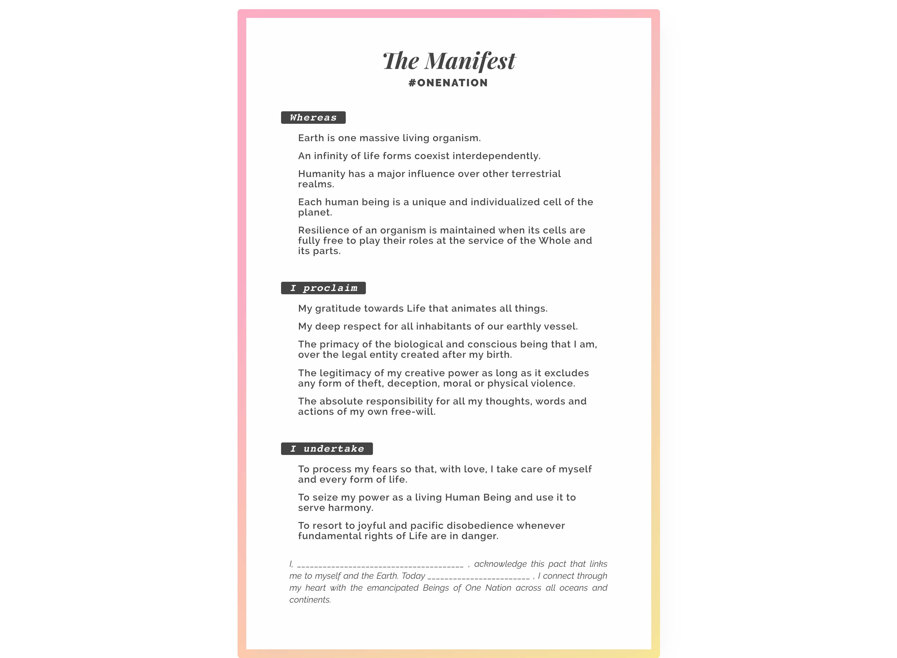

Governments are failing in their mission.  
They do not care for Human Beings or the Earth.  
We no longer trust them, they have lost our respect.

_But what can we do?_

Complain? Boring...  
Protest? Too dangerous!  
Vote? Fruitless.  
Fight? Can't be bothered!

**What if we would create a nation instead!?**

> **By nation it is meant**: "A rather large group of Human Beings, characterised by an awareness of its unity and by the will to live together".

## Website, Manifesto, FAQ and more...

- Visit [https://onenation.xyz](https://onenation.xyz)
- Read [the manifesto](./manifest/README.md) (5+ languages)

_The website is hosted on Github pages. [Read more](./website/README.md)_

## Guidelines

One Nation is Open Source & decentralised.  
This is the **first & original repository** (onenation.xyz).  

It is supposed to remain minimalistic with only the essential: 
- The [original Manifesto](./manifest/fr_manifeste.md) (French version)
- The [translations of the Manifesto](./manifest) in other languages
- The [original logo](./logo)
- The [website](https://onenation.xyz) (multilingual)

## Contribute

One Nation is headless, so you are free to collaborate/append/modify/fork anything without asking permission. As long as your intentions embrace the values of the Manifesto, go for it! 

If you want to meet people, you can join the party on Telegram.  
[Join Telegram groups](https://onenation.xyz/en/#faq-contribute)

